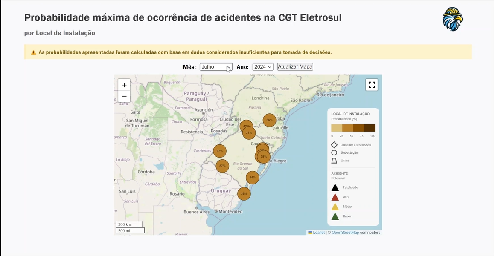

# SVAA - Sistema de Verificação Antecipada de Acidentes


## Pré-requisitos
- [Python 3.11.7](https://www.python.org/downloads/release/python-3117/)
- O diretório base da pasta de código deve ser chamado `FIT-SPARK-HHRisco`.

## Dados de entrada
- bd_acidentes.xlsx
- IW47-Confirmações_Executadas_2020-a-28jun24.xlsx
- ESUL-LIs-exceto linhas.xlsx
- ESUL-LIs-LTs e vaos torres.xlsx
- Suporte-TAM.xlsx
- ZPM_DATAS_ORDEM_Executadas-2020-até-28jun24.xlsx

## Dado de entrada opcional
- dataset_dados_meteorologicos.csv
Para acelerar a execução do código, é recomendado incluir o arquivo acima. Ele estará disponível na pasta compactada `Dados.zip`

## Setup
1. Abrir a pasta `Dados`.
2. Copiar os dados de entrada dentro da pasta.
3. Abrir a pasta `FIT-SPARK-HHRisco`.
4. Colar as tabelas copiadas na pasta `FIT-SPARK-HHRisco\data\input`.

## Instalação
1. Abrir o terminal no diretório base da pasta de código `FIT-SPARK-HHRisco`.
2. Executar o comando de instalação das bibliotecas.
2.1. `pip install -r requirements.txt`

## Como usar
### 1. Rodando a pipeline
Abaixo seguem os comandos necessários para rodar o código do projeto.
```
# Abrir o terminal no diretório base do projeto.
cd FIT-SPARK-HHRisco

# Executar o arquivo run.
## Para Windows:
.\run.cmd
## Para Linux:
./run.sh
```
O comando acima instala todas as dependências necessárias para o funcionamento dos códigos, processa as tabelas de entrada e constrói o dataset de treinamento dos modelos.

### 2. Treinando os modelos
Para treinar os modelos e extrair o melhor, é necessário executar os comandos abaixo:
```
# Navegar para pasta de treinamento dos modelos
cd src\core\modelo

# Executar o arquivo de treinamento dos modelos
python modelos.py
```
Esse arquivo gera o dataset de entrada para o mapa.
### 3. Gerar o mapa
Para rodar o mapa, é necessário executar os comandos abaixo:
```
# Voltar ao diretório raiz
cd ../../..

# Navegar para a pasta do arquivo que gera o mapa
cd src/core/mapa

# Rodar o servidor Flask localmente
python.\app.py
```
Finalmente, deve-se abrir num navegador qualquer o link gerado pelo flask. Esse link aparecerá no terminal.
Por exemplo: `http://127.0.0.1:5000`

## Como retreinar os modelos

Para retreinar os modelos com os dados atualizados, é necessário:
1. Inserir os dados atualizados na pasta `Dados` (vide Setup)
2. Executar o passo a passo da seção `Como usar`
